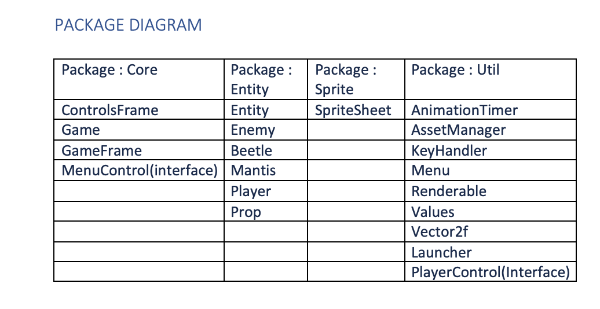
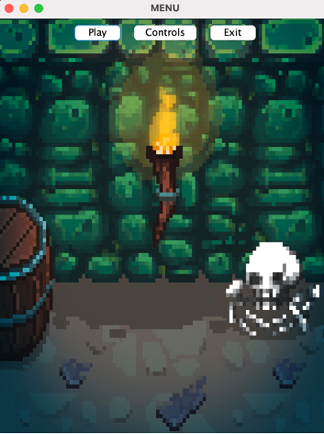
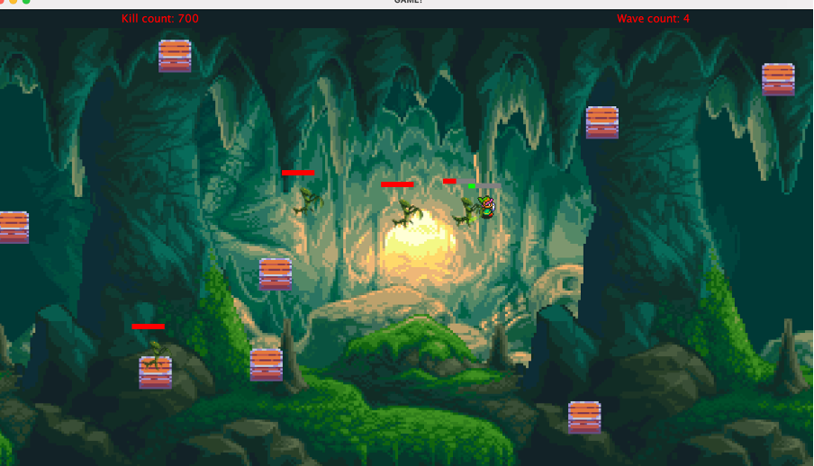
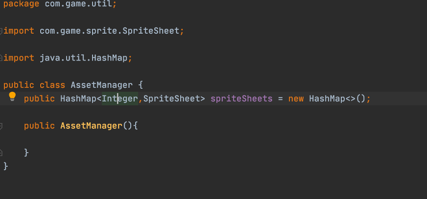
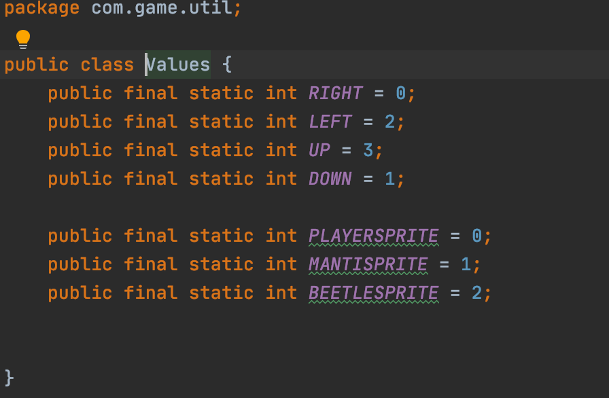
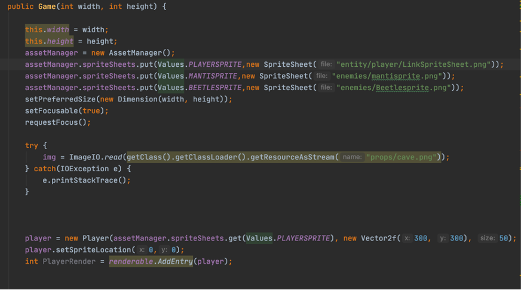
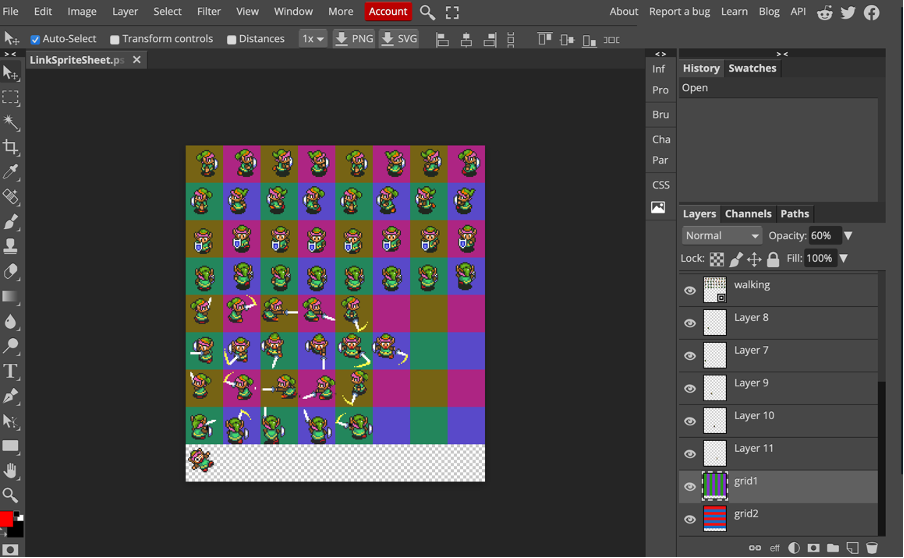

# Re creating a classic 2D arcade game
> As part a part of my CE301 Capstone project i was tasked with creating a classic 2D arcade game. Instead of creating the general classic game, i decided to take games i grew up on playing and implementing them in to my own game using Java. Giving a subjective spin on what it means to create a 'classic' game. Below decoumented is a description and overview of the game created by myself, 'The Killing of Kaz'. 

## Table of contents
* [General info](#general-info)
* [Screenshots](#screenshots)
* [Technologies used](#technologies-used)
* [Setup](#setup)
* [Features](#features)
* [Status](#status)
* [Inspiration](#inspiration)
* [Character creation](#character-creation)

## General info
It is recommened to use Java version 15.0.1 or later when running the project for the best compatability. Simply pull the project on from the repository and use the preferred Java IDE to run it on, it is recommened to use IntelliJ IDEA for ease of use. The system uses four packages with a number of classes within each of them, to carry out particular functions, with the main class being Gama.Java.

## Screenshots
Package diagram shown below for structure of the program:

Gameplay for The Killing of Kaz shown below:

## Technologies used
* Java version 14 or later is recommened to use to run the system.
* Adobe Photoshop for creation of sprites

## Setup
To build the Jar file go to:
File | Project Structure | Artifacts then you have to press alt+insert or click the plus symbol and design new artifact pick --> jar --> From modules with dependencies.
Next goto Build | Build artifacts --> collect your artifact.
Alternatively you can pull the source code from the repository, run it on a Java IDE and run the Launcher.Java class to start the game.

## Code Examples
Areas to note:
I created an asset manager class ‘AssetManager’ which uses a HashMap to store two types of data to be used. The first being an integer value which referenced my Values class, so I know which direction the sprite needs to access, and the second value is a reference for the sprite sheet class ‘SpriteSheet’ which controls which sprites to read in a sheet using a sprite array of X and Y values to retrieve the animations in each row and column. Within class ‘Values’ are references of the sprite sheets directions; up, down, left, right and an integer reference for the three different sprite sheets that are used in the game. Below is a brief snippet showing the hashmap being created as well as the Values to be used, these are stored in package util. We then see the sprites being loaded on to the game frame in the main class Game.Java.

## Features
Game mechanics:
*   RPG style menu system
*   Collision detection 
*   Randomly generated obstacles 
*   Custom sprite frame creation
*   Animated sprite movement 
*   Timer to animate player attacking smoothly
*   WASD X Arrow key movement for player
*   Automated enemy path finding system
*   Attack systems utilizing threading 
*   Health bar damage system
*   Periodical health regeneration 
*   Wave counter system with automatic spawning
*   Score tracking system
*   Range detection for automated enemy attacking 
*   Enemy boss levels 
*   Death animations for enemies  

## Character creation

To-do list:
* Create a scoreboard with stored scores from previous games and output on to a seperate screen.

## Status
Project is: Finished with a few small additions being implemented.

## Inspiration
Project inspired by The Legend of Zelda: A Link To The Past &. Box Head
